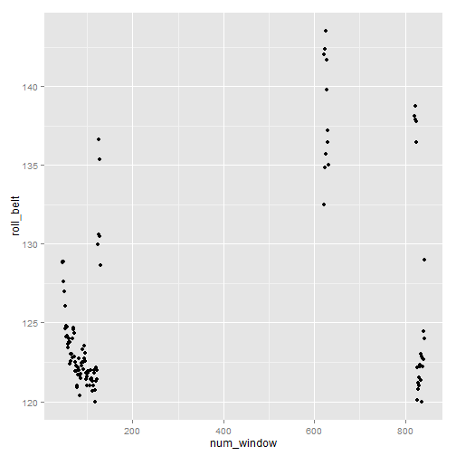

#### Get the data:

```r
if (! file.exists("pml-training.csv")) 
  download.file("https://d396qusza40orc.cloudfront.net/predmachlearn/pml-training.csv", destfile = "pml-training.csv")
data.train = read.csv("pml-training.csv", stringsAsFactors = FALSE)

if (! file.exists("pml-training.csv")) 
  download.file("https://d396qusza40orc.cloudfront.net/predmachlearn/pml-testing.csv", destfile = "pml-testing.csv")
data.test = read.csv("pml-testing.csv", stringsAsFactors = FALSE)
```
Where data.train will be used for training and testing the model before applying on the data.test  

#### Partition data.train for Cross Validation:
75% for training and 25% for testing.

```r
library(caret)
STATIC_SEED = 8484
set.seed(STATIC_SEED)

inTrain = createDataPartition(data.train$classe, p = 3/4)[[1]]
training = data.train[ inTrain,]
testing = data.train[-inTrain,]
str(training, list.len=50)
```

```
## 'data.frame':	14718 obs. of  160 variables:
##  $ X                       : int  1 2 3 4 6 7 8 9 10 11 ...
##  $ user_name               : chr  "carlitos" "carlitos" "carlitos" "carlitos" ...
##  $ raw_timestamp_part_1    : int  1323084231 1323084231 1323084231 1323084232 1323084232 1323084232 1323084232 1323084232 1323084232 1323084232 ...
##  $ raw_timestamp_part_2    : int  788290 808298 820366 120339 304277 368296 440390 484323 484434 500302 ...
##  $ cvtd_timestamp          : chr  "05/12/2011 11:23" "05/12/2011 11:23" "05/12/2011 11:23" "05/12/2011 11:23" ...
##  $ new_window              : chr  "no" "no" "no" "no" ...
##  $ num_window              : int  11 11 11 12 12 12 12 12 12 12 ...
##  $ roll_belt               : num  1.41 1.41 1.42 1.48 1.45 1.42 1.42 1.43 1.45 1.45 ...
##  $ pitch_belt              : num  8.07 8.07 8.07 8.05 8.06 8.09 8.13 8.16 8.17 8.18 ...
##  $ yaw_belt                : num  -94.4 -94.4 -94.4 -94.4 -94.4 -94.4 -94.4 -94.4 -94.4 -94.4 ...
##  $ total_accel_belt        : int  3 3 3 3 3 3 3 3 3 3 ...
##  $ kurtosis_roll_belt      : chr  "" "" "" "" ...
##  $ kurtosis_picth_belt     : chr  "" "" "" "" ...
##  $ kurtosis_yaw_belt       : chr  "" "" "" "" ...
##  $ skewness_roll_belt      : chr  "" "" "" "" ...
##  $ skewness_roll_belt.1    : chr  "" "" "" "" ...
##  $ skewness_yaw_belt       : chr  "" "" "" "" ...
##  $ max_roll_belt           : num  NA NA NA NA NA NA NA NA NA NA ...
##  $ max_picth_belt          : int  NA NA NA NA NA NA NA NA NA NA ...
##  $ max_yaw_belt            : chr  "" "" "" "" ...
##  $ min_roll_belt           : num  NA NA NA NA NA NA NA NA NA NA ...
##  $ min_pitch_belt          : int  NA NA NA NA NA NA NA NA NA NA ...
##  $ min_yaw_belt            : chr  "" "" "" "" ...
##  $ amplitude_roll_belt     : num  NA NA NA NA NA NA NA NA NA NA ...
##  $ amplitude_pitch_belt    : int  NA NA NA NA NA NA NA NA NA NA ...
##  $ amplitude_yaw_belt      : chr  "" "" "" "" ...
##  $ var_total_accel_belt    : num  NA NA NA NA NA NA NA NA NA NA ...
##  $ avg_roll_belt           : num  NA NA NA NA NA NA NA NA NA NA ...
##  $ stddev_roll_belt        : num  NA NA NA NA NA NA NA NA NA NA ...
##  $ var_roll_belt           : num  NA NA NA NA NA NA NA NA NA NA ...
##  $ avg_pitch_belt          : num  NA NA NA NA NA NA NA NA NA NA ...
##  $ stddev_pitch_belt       : num  NA NA NA NA NA NA NA NA NA NA ...
##  $ var_pitch_belt          : num  NA NA NA NA NA NA NA NA NA NA ...
##  $ avg_yaw_belt            : num  NA NA NA NA NA NA NA NA NA NA ...
##  $ stddev_yaw_belt         : num  NA NA NA NA NA NA NA NA NA NA ...
##  $ var_yaw_belt            : num  NA NA NA NA NA NA NA NA NA NA ...
##  $ gyros_belt_x            : num  0 0.02 0 0.02 0.02 0.02 0.02 0.02 0.03 0.03 ...
##  $ gyros_belt_y            : num  0 0 0 0 0 0 0 0 0 0 ...
##  $ gyros_belt_z            : num  -0.02 -0.02 -0.02 -0.03 -0.02 -0.02 -0.02 -0.02 0 -0.02 ...
##  $ accel_belt_x            : int  -21 -22 -20 -22 -21 -22 -22 -20 -21 -21 ...
##  $ accel_belt_y            : int  4 4 5 3 4 3 4 2 4 2 ...
##  $ accel_belt_z            : int  22 22 23 21 21 21 21 24 22 23 ...
##  $ magnet_belt_x           : int  -3 -7 -2 -6 0 -4 -2 1 -3 -5 ...
##  $ magnet_belt_y           : int  599 608 600 604 603 599 603 602 609 596 ...
##  $ magnet_belt_z           : int  -313 -311 -305 -310 -312 -311 -313 -312 -308 -317 ...
##  $ roll_arm                : num  -128 -128 -128 -128 -128 -128 -128 -128 -128 -128 ...
##  $ pitch_arm               : num  22.5 22.5 22.5 22.1 22 21.9 21.8 21.7 21.6 21.5 ...
##  $ yaw_arm                 : num  -161 -161 -161 -161 -161 -161 -161 -161 -161 -161 ...
##  $ total_accel_arm         : int  34 34 34 34 34 34 34 34 34 34 ...
##  $ var_accel_arm           : num  NA NA NA NA NA NA NA NA NA NA ...
##   [list output truncated]
```

Original Number of Columns is 160. 
Original Number of Rows is 14718. 
Reduce number of rows and columns for training.

Data contains statistics that have contain many NAs
like columns that start with "kurtosis_","skewness_","max_", 
                       "min_", "amplitude_", "avg_","var_","stddev_"  
for example "max_roll_belt" has 
97.9005 percentage of NA's.

#### Therefore remove statistics columns:

```r
col.input = colnames(training)
statistics_columns = c("kurtosis_","skewness_","max_", 
                       "min_", "amplitude_", "avg_","var_","stddev_")
columnsToRemove = list()
for (col in statistics_columns) {
  columnsToRemove = c(columnsToRemove, 
                      grep(col, col.input)
  )
}
columnsToRemove = unlist(columnsToRemove)
training = training[, -columnsToRemove]
```

Number of Columns after removing statistics is 60.

Exploring some rows:

```r
head(training[,2:7])
```

```
##   user_name raw_timestamp_part_1 raw_timestamp_part_2   cvtd_timestamp
## 1  carlitos           1323084231               788290 05/12/2011 11:23
## 2  carlitos           1323084231               808298 05/12/2011 11:23
## 3  carlitos           1323084231               820366 05/12/2011 11:23
## 4  carlitos           1323084232               120339 05/12/2011 11:23
## 6  carlitos           1323084232               304277 05/12/2011 11:23
## 7  carlitos           1323084232               368296 05/12/2011 11:23
##   new_window num_window
## 1         no         11
## 2         no         11
## 3         no         11
## 4         no         12
## 6         no         12
## 7         no         12
```

"raw_timestamp_part_1" is the time stamp up to seconds,
"raw_timestamp_part_2" is the milliseconds.
Realise that for the same "num_window", they belong to the same second.

```r
training[training$user_name == "carlitos" & 
                training$num_window == 12,3:7]
```

```
##    raw_timestamp_part_1 raw_timestamp_part_2   cvtd_timestamp new_window
## 4            1323084232               120339 05/12/2011 11:23         no
## 6            1323084232               304277 05/12/2011 11:23         no
## 7            1323084232               368296 05/12/2011 11:23         no
## 8            1323084232               440390 05/12/2011 11:23         no
## 9            1323084232               484323 05/12/2011 11:23         no
## 10           1323084232               484434 05/12/2011 11:23         no
## 11           1323084232               500302 05/12/2011 11:23         no
## 14           1323084232               576390 05/12/2011 11:23         no
## 15           1323084232               604281 05/12/2011 11:23         no
## 17           1323084232               692324 05/12/2011 11:23         no
## 18           1323084232               732306 05/12/2011 11:23         no
## 19           1323084232               740353 05/12/2011 11:23         no
## 20           1323084232               788335 05/12/2011 11:23         no
## 21           1323084232               876301 05/12/2011 11:23         no
## 22           1323084232               892313 05/12/2011 11:23         no
## 24           1323084232               996313 05/12/2011 11:23        yes
##    num_window
## 4          12
## 6          12
## 7          12
## 8          12
## 9          12
## 10         12
## 11         12
## 14         12
## 15         12
## 17         12
## 18         12
## 19         12
## 20         12
## 21         12
## 22         12
## 24         12
```
Will aggregate the rows of the same num_window.

#### Aggregating the rows by 

```r
data.means <- aggregate(training[,-c(1:7,60)], 
                         by = list(training$user_name, 
                                   training$num_window, 
                                   training$classe),
                         FUN=mean)
colnames(data.means) = c("user_name", "num_window", "classe",
                         colnames(data.means)[-c(1:3)])
```

Plot of "roll_belt" of Pedro,   
Before Aggregating:
 

After Aggregating:
 
  
The shape of the graphs before and after are similar therefore will use the aggregated data.
Number of Rows after aggregating is 858.

#### Training a Random Forest Model:
1. Note that "user_name" and "num_window" will not be used as a predictor.
the time or the person who did the exercise should not matter during training so that it will apply to other people during other times.
2. the target variable, "classe" is a factor.

```r
colnames(data.means)[1:2]
```

```
## [1] "user_name"  "num_window"
```

```r
training2 = data.means[,-c(1:2)]
training2$classe = factor(training2$classe)

set.seed(STATIC_SEED)
modelFit <- train(classe ~ ., data = training2, 
                  method="rf", prox=TRUE)
modelFit
```

```
## Random Forest 
## 
## 858 samples
##  52 predictors
##   5 classes: 'A', 'B', 'C', 'D', 'E' 
## 
## No pre-processing
## Resampling: Bootstrapped (25 reps) 
## 
## Summary of sample sizes: 858, 858, 858, 858, 858, 858, ... 
## 
## Resampling results across tuning parameters:
## 
##   mtry  Accuracy  Kappa  Accuracy SD  Kappa SD
##   2     0.9       0.8    0.03         0.03    
##   30    0.9       0.8    0.02         0.03    
##   50    0.8       0.8    0.03         0.03    
## 
## Accuracy was used to select the optimal model using  the largest value.
## The final value used for the model was mtry = 2.
```

The Importance of Variables as deemed by the model:

```r
varImp(modelFit)
```

```
## rf variable importance
## 
##   only 20 most important variables shown (out of 52)
## 
##                      Overall
## roll_belt              100.0
## pitch_forearm           72.0
## accel_belt_z            68.5
## magnet_dumbbell_y       65.9
## total_accel_belt        64.5
## magnet_belt_y           64.3
## roll_dumbbell           63.4
## magnet_dumbbell_z       63.0
## yaw_belt                60.8
## magnet_dumbbell_x       59.6
## magnet_arm_x            55.2
## magnet_forearm_x        53.8
## magnet_belt_z           53.7
## accel_forearm_x         49.2
## pitch_belt              49.2
## accel_dumbbell_y        47.0
## accel_arm_x             44.6
## accel_dumbbell_z        39.5
## accel_dumbbell_x        39.2
## total_accel_dumbbell    38.3
```

#### Testing the model:
( the rows are not aggregated for the testing data, will test all. 
The statistics columns are not removed also, as the random forest will only look for relevant columns for the predict. )

```r
actual = factor(testing$classe)
testing.use = testing[,-c(1:7, 160)]
predicted = predict(modelFit, testing.use)
confusionMatrix(actual, predicted)
```

```
## Confusion Matrix and Statistics
## 
##           Reference
## Prediction    A    B    C    D    E
##          A 1334   32    9   16    4
##          B   54  820   67    2    6
##          C   12   40  773   16   14
##          D   15   15   51  702   21
##          E   13   21   10   16  841
## 
## Overall Statistics
##                                         
##                Accuracy : 0.912         
##                  95% CI : (0.903, 0.919)
##     No Information Rate : 0.291         
##     P-Value [Acc > NIR] : < 2e-16       
##                                         
##                   Kappa : 0.888         
##  Mcnemar's Test P-Value : 2.47e-08      
## 
## Statistics by Class:
## 
##                      Class: A Class: B Class: C Class: D Class: E
## Sensitivity             0.934    0.884    0.849    0.934    0.949
## Specificity             0.982    0.968    0.979    0.975    0.985
## Pos Pred Value          0.956    0.864    0.904    0.873    0.933
## Neg Pred Value          0.973    0.973    0.966    0.988    0.989
## Prevalence              0.291    0.189    0.186    0.153    0.181
## Detection Rate          0.272    0.167    0.158    0.143    0.171
## Detection Prevalence    0.284    0.194    0.174    0.164    0.184
## Balanced Accuracy       0.958    0.926    0.914    0.954    0.967
```
Out of Sample Accuracy of above 85% looks good.

#### Using the model on the 20 test cases 
where the target variable, "classe" is not known.

```r
predicted.real = predict(modelFit, data.test)
predicted.real
```

```
##  [1] B A A A A E D B A A A C B A E E A B B B
## Levels: A B C D E
```

```r
predicted.real.prob = predict(modelFit, data.test, type="prob")
predicted.real.prob[c(3,11),] #the ones that got wrong
```

```
##        A     B     C     D     E
## 3  0.314 0.166 0.238 0.058 0.224
## 11 0.386 0.202 0.274 0.076 0.062
```
Probability of the classes were not high for the ones that were wrongly predicted.
